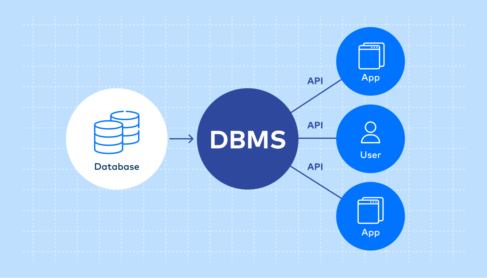
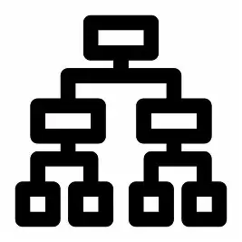

# Introduction

## SQL

- Structured Query Language is used to store, manage and retrieve data from relational database
- Ex- MySQL, Oracle, PostgreSQL and SQL Server

### MySQL:

- MySQL is a relational database management system that stores data and executes SQL commands on that data.

| **SQL**                                                                                                          | **MySQL**                                                                                           |
| ---------------------------------------------------------------------------------------------------------------------- | --------------------------------------------------------------------------------------------------------- |
| Structured Query Language is used to store, manage and retrieve data from relational database                          | MySQL is a relational database management system that stores data and executes SQL commands on that data. |
| SQL only defines the rules and syntax for communicating with a database and it cannot store or process data by itself. | MySQL actually processes the SQL queries and manages the data internally.                                 |
| SQL is common and works with many database systems like MySQL, Oracle, PostgreSQL, and SQL Server.                     | MySQL is one specific database system that follows the SQL standard.                                      |
| SQL does not require installation because it is just a language used inside database systems.                          | MySQL must be installed on a system to create, store, and manage databases.                               |

| SQL                                                                                                    | No-SQL                                                                                       |
| ------------------------------------------------------------------------------------------------------ | -------------------------------------------------------------------------------------------- |
| sequel has fix schema, means structure need to be same for all data                                    | it’s schema less, different data can have different data type means full flexibility        |
| sequel allow vertical scaling, means in same machine we can add more memory, cpu, rams                 | no-sql allow horizontal scaling, means you can add more servers & handle huge trafic as well |
| sequel has consistency & it fallows acid property due to this it is used in banking, employee data etc | no-sequel is used for unstructured data                                                      |

can we use both sql & nosql at same time ?

yes we can like in instagram it uses sql for user login info, and it uses nosql for like comments

---

## Data

- ***Data is a collation of row unorganized facts and details.***
- It does’t have context or meaning unless it processed and organized.
- Data can be *numbers, text, symbols, images,* etc.
- Example: For a Student, properties/attributes like
  - SID: 101
  - SName: Kaif
  - Gender: M
  - Age: 25

    These are values/data describing the entity.

    ---

## **Information**

- **Information** is ***processed**, **organized**, and **structured** data*
- It’s extracted from data by analyzing and interpreting pieces of data
- Example-

  If you calculate:

  > “The average age of students is 25”
  >

  That’s **information**, because it provides *meaning* and *insight* derived from data.

---

## Database

- Database is an electronic place or system where data is stored in a way such that it can easily accessed, managed and update.
- These are the operations which we can perform on the database and those are :

1. CREATE / INSERT
2. READ / RETRIEVE
3. UPDATE / MODIFY
4. DELETE / DROP

These operations are universally referred as CRUD Operations.

---

## DBMS

- Database Management System is a software tool that enable users to create and manage database easily.

  
- Example: Data stored inside a database, which is managed using a DBMS.

**TYPES OF DBMS** :

1. HDBMS (HIERARCHICAL)
2. NDBMS( NETWORK)
3. OODBMS (OBJECT ORIENTED)
4. NoSQL DBMS(Not Only SQL)
5. RDBMS (RELATIONAL)

## Security Features of DBMS

1. Authentication: Used to instruct or communicate with DBMS software (often using a query language).
2. Authorization: DBMS stores the data in various file formats (e.g., MongoDB, CassandraDB, DynamoDB).

---

Types of DBMS:

1. Hierarchical DBMS-

   - Organizes data in a **tree-like structure**, where each record has **one parent** and can have **multiple child records**.
   - Navigation through the tree is done using **pointers or links**.
   - It supports **one-to-many relationships**.

   
2. Network DBMS-

   - Represents data using a **graph structure** consisting of **nodes (records)** and **edges (links) which** Allows **many-to-many relationships** between entities.
   - Each child record can have **multiple parent records**.
   - More **flexible than a hierarchical DBMS**, but **complex to design and maintain**.

   
3. Object Oriented DBMS-

   - OODBMS Stores data in the form of **objects**, similar to the concepts used in **Object-Oriented Programming (OOP)**.
   - Supports key OOP principles such as **Inheritance**, **Encapsulation**, and **Polymorphism**.
   - Ideal for applications that involve **multimedia**, **complex data types**, or **object relationships**.
4. NoSQL DBMS-

   - Designed to handle **unstructured** or **semi-structured** data while offering **high scalability** and **performance**.
   - Does **not use tables and relationships** like traditional RDBMS.
   - Supports various **data models**, including:
     1. **Key–Value stores** (e.g., Redis)
     2. **Document-based** databases (e.g., MongoDB)
     3. **Column-oriented** databases (e.g., Cassandra)
     4. **Graph databases** (e.g., Neo4j)
   - Ideal for **Big Data**, **real-time analytics**, and **distributed systems**.
   - Provides **horizontal scalability** — by adding more servers instead of upgrading a single one.

   
5. RDBMS-

   - Stores data in the form of **tables (relations)** consisting of **rows (records)** and **columns (attributes)**.
   - Data is accessed and manipulated using **Structured Query Language (SQL)**.
   - It is the **most widely used** type of DBMS for business and enterprise applications.

   

## DIFFERENCE BETWEEN DBMS & RDBMS

| DBMS                                                                      | RDBMS                                                                                        |
| ------------------------------------------------------------------------- | -------------------------------------------------------------------------------------------- |
| 1. DBMS is software used to**create, store, and manage** databases. | 1. When a DBMS follows the**relational model**, it becomes **RDBMS**.            |
| 2. Data is stored in the form of**files**.                          | 2. Data is stored in the form of**tables (relations)** consisting of rows and columns. |
| 3. Uses a**Query Language (QL)** to interact with the database.     | 3. Uses**Structured Query Language (SQL)** to manage and access data.                  |
| 4.**Normalization** is generally **not supported**.           | 4.**Normalization** is supported to reduce redundancy and improve consistency.         |
| 6. Suitable for**small-scale applications**.                        | 6. Suitable for**large-scale and enterprise applications**.                            |
| 7. Examples:**File System, XML Database**.                          | 7. Examples:**MySQL, Oracle, PostgreSQL, SQL Server**.                                 |

[Relational Model](<Relational%20Model%202997ce6c5c2580c1afe9f99b413c673b.md>)

[Practise 1 (1)](<Introduction/Practise%201%20(1)%202997ce6c5c25802a84fde87315656b0c.md>)
