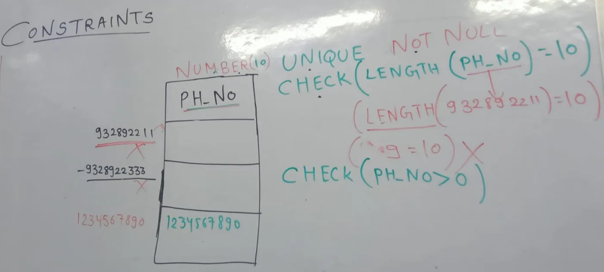
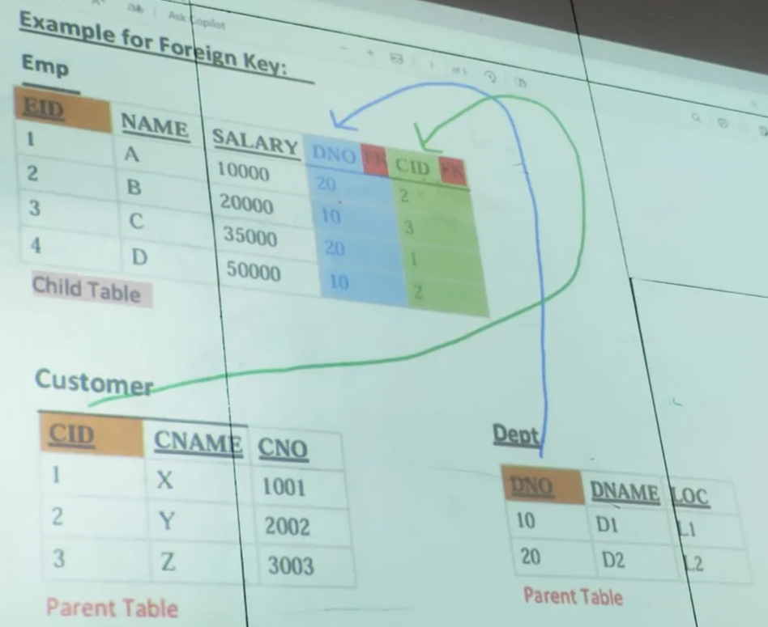

# Constraints

### Constraints are the rule given to a Column to validate the data.

## TYPES OF CONSTRAINST

1. UNIQUE
2. NOT NULL
3. CHECK
4. PRIMARY KEY
5. FOREIGN KEY

## 1. UNIQUE

- It Ensures that all values in a column are different.

## 2. NOT NULL

- It Ensures that a column cannot contain NULL (empty) values.

## 3. CHECK

1. Restricts values in a column based on a specified condition if condition is satisfied it will accept the value or else reject the value

## 4. PRIMARY KEY

1. It is use to identify record uniquely from the table.
2. Characteristics of the Primary Key
   1. We can have only 1 primary key in the table
   2. It does not accept any duplicated or repeated values
   3. it does not accept any null values
   4. it is combination of
      1. UNIQUE Constraint
      2. NOT NULL Constraint
   5. It is not Mandatory but highly Recommended

### 5. FOREIGN KEY

1. It is used to establish connection between multiple tables
2. Characteristics of the Foreign Key
   1. we can have multiple foreign key in a table
   2. it accepts the duplicated or repeated values
   3. it accepts the Null values
   4. for an attribute to become foreign key in child table it should be primary key in parent table
   5. when primary key of 1 table travel to another table then it will become foreign key
   6. it is also called Referential Integrity constraint
      1. Referential - Reference…
      2. Integrity - Data must not be changed while

[Statements](<Statements%2029a7ce6c5c25800e9f08e09be750bfcf.md>)
