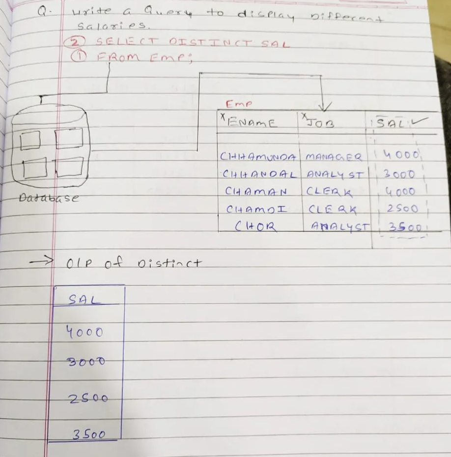

# Distinct

- **DISTINCT is a keyword used to remove duplicate values** from the output of a column or expression.
- It must appear **immediately after the SELECT keyword**.
- when applied to **multiple columns** — it removes duplicate rows based on the **combination** of those columns.
- DISTINCT affects only the **result set**, not the real table.

[Where Clouse](<Where%20Clouse%2029a7ce6c5c2580619ed0e24de1dac3fe.md>)
