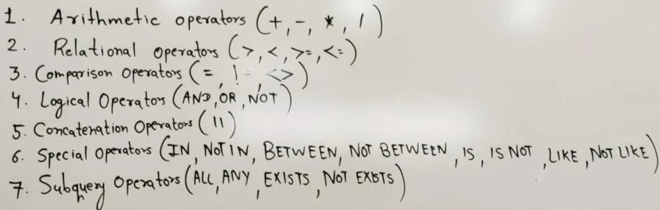

# Operators

Operators

1. Operator is a symbols use to perform specific task.

## Type of Operators

1. Arithmetic Operator
   1. 
   2. 
   3. 
   4. /
2. Relational Operator
   1. 
   2. <
   3. ≥
   4. ≤
3. Comparison Operator
   1. =
   2. ! =
   3. <>
4. Logical Operator [‣](https://app.notion.com/p/286c39cfacc580399c84df12ff61b664?pvs=21)
   1. AND
   2. OR
   3. NOT
5. Concatenation Operator
   1. ||
6. Special Operators
   1. IN
   2. NOT IN
   3. BETWEEN
   4. NOT BETWEEN
   5. IS
   6. IS NOT
   7. LIKE
   8. NOT LIKE
7. Subquery Operators
   1. ALL
   2. ANY
   3. EXISTS
   4. NOT EXISTS

[Logical Operators](<Logical%20Operators%2029a7ce6c5c2580aa97a3d8e96a1b03b9.md>)
