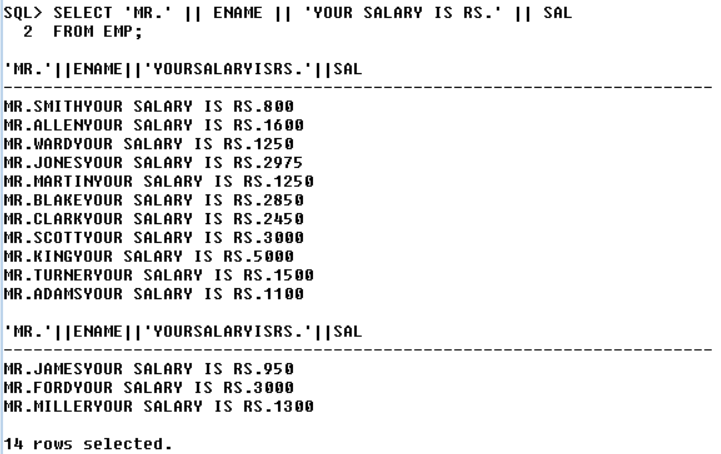

# Concatination

1. This Operator is use to JOIN the given 2 Strings.

<aside>
❓

WAQTD THE OUTPUT IN THE FOLLWING FORMAT

1. ‘MR.ABC YOUR SALARY IS RS.XYZ’

```sql
SELECT 'MR.' || ENAME || 'YOUR SALARY IS RS.' || SAL
FROM EMP;
```

SELECT *
FROM EMP
WHERE ENAME LIKE '%A%A%';



b.

```sql
SELECT 'MR.' || ENAME || ' YOUR SALRY IS RS. ' || SAL
FROM EMP
WHERE ENAME = 'SMITH';
```


</aside>

[Function](<Function%2029a7ce6c5c2580448467fda6a1def16a.md>)
