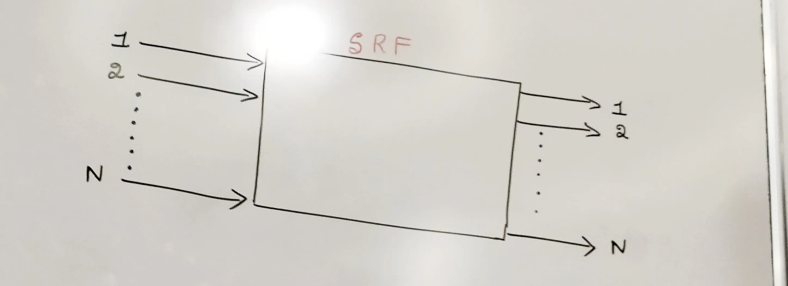
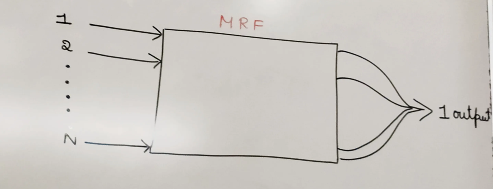
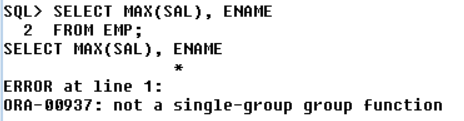
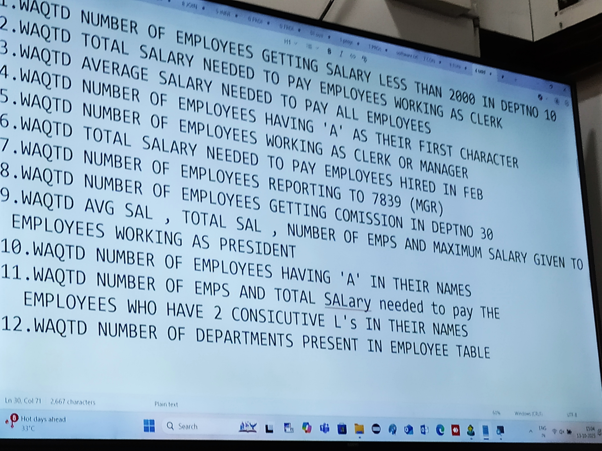

# Function

# WHAT IS FUNCTION (IMP)

- A *Function* is a **list of instructions** used to perform a **specific task**.

## TYPES OF FUNCTIONS

### **A. User-defined Functions**

- Used in **PL/SQL (procedural language)**.

### **B. Inbuilt Functions**

- Used in **SQL**.
- It has two types:
  1. **Single Row Function (SRF)**
  2. **Multi Row / Group / Aggregate Function (MRF)**

# **Single Row Function (SRF):**

- Single row functions return one result per row when applied to table data.
- Single row function executes **row-by-row**.
- It takes **one input at a time**, processes it, and produces **one output**.
- If we pass **n inputs**, it will return **n outputs**.

  

# **Multi Row / Group / Aggregate Function (MRF)**

- Multi-row functions (also known as group or aggregate functions) operate on a group of rows and return a single value as the result.
- It executes **group-by-group**.
- It takes multiple **inputs at once**, process them, and returns **one output**.
- If we pass **n inputs**, it still returns **a single output**.

  

## **List of Aggregate Functions**

1. **MAX()**
2. **MIN()**
3. **SUM()**
4. **AVG()**
5. **COUNT()**

<aside>
💡

# **Important Characteristics of MRF (Very Important)**

1. **MRF can accept only one argument** → a *column name* or an *expression*.
2. **MAX()** and **MIN()** can work on **CHAR**, **VARCHAR**, **NUMBER**, and **DATE** datatypes.
3. **SUM()** and **AVG()** work **only on NUMBER datatype**.
4. **COUNT**() works on all datatypes.
5. **MRF ignore NULL values** while calculating results.
6. **We cannot use MRF in WHERE clause**
   - Reason: *WHERE executes row-by-row* but *MRF executes group-by-group*.
   - Solution: Use **subquery**.
7. **We cannot use any column or expression along with MRF in SELECT clause**
   - i.e., SELECT MAX(sal), empno → ❌ Not allowed
   - Unless using **GROUP BY**

- COUNT() is the only MRF to which we can pass ‘*’ as an argument.

</aside>

```sql
SELECT MAX(SAL), ENAME
FROM EMP;

OUTPUT:
SELECT MAX(SAL), ENAME
                 *
ERROR at line 1:
ORA-00937: not a single-group group function

```





<aside>
❓

WAQTD number of employees getting salary less than 2000 in deptno 10

```sql
SELECT COUNT(SAL)
FROM EMP
WHERE SAL < 2000 AND DEPTNO IN (10);
```


</aside>

<aside>
❓

WAQTD total salary needed to pay employees working as clerk

```sql
SELECT SUM(SAL)
FROM EMP
WHERE JOB = 'CLERK';
```


</aside>

<aside>
❓

WAQTD average salary needed to pay all employees

```sql
SELECT AVG(SAL)
FROM EMP;
```


</aside>

<aside>
❓

WAQTD number of employees having 'A' as their first character

```sql
SELECT COUNT(ENAME)
FROM EMP
WHERE ENAME LIKE 'A%';
```


</aside>

<aside>
❓

WAQTD number of employees working as clerk or manager

```sql
SELECT COUNT(EMPNO)
FROM EMP
WHERE JOB IN ('CLERK','MANAGER');
```


</aside>

<aside>
❓

WAQTD total salary needed to pay employees hired in Feb

```sql
SELECT SUM(SAL)
FROM EMP
WHERE HIREDATE LIKE '%FEB%';
```


</aside>

<aside>
❓

WAQTD number of employees reporting to 7839 (MGR)

```sql
SELECT COUNT(EMPNO)
FROM EMP
WHERE MGR IN (7839);
```


</aside>

<aside>
❓

WAQTD avg sal, total sal, getting commission in deptno 30

```sql
SELECT AVG(SAL), SUM(SAL)
FROM EMP
WHERE (COMM IS NOT NULL) AND (DEPTNO IN (30));
```


</aside>

<aside>
❓

WAQTD number of employees working as president and maximum salary given to employees working as president

```sql
SELECT COUNT(EMPNO), MAX(SAL)
FROM EMP
WHERE JOB IN ('PRESIDENT');
```


</aside>

<aside>
❓

WAQTD number of employees having 'A' in their names

```sql
SELECT COUNT(EMPNO)
FROM EMP
WHERE ENAME LIKE '%A%';
```


</aside>

<aside>
❓

WAQTD number of emps and total salary needed to pay the employees who have 2 consecutive 'L's in their names

```sql
SELECT COUNT(EMPNO), SUM(SAL)
FROM EMP
WHERE ENAME LIKE '%LL%';
```


</aside>

<aside>
❓

WAQTD number of departments present in employee table

```sql
SELECT COUNT(DISTINCT DEPTNO)
FROM EMP;
```


</aside>

[Group By Clouse](<Group%20By%20Clouse%2029a7ce6c5c2580ebbd2ac41eb130b161.md>)
