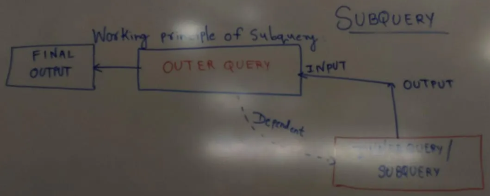
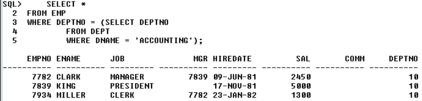
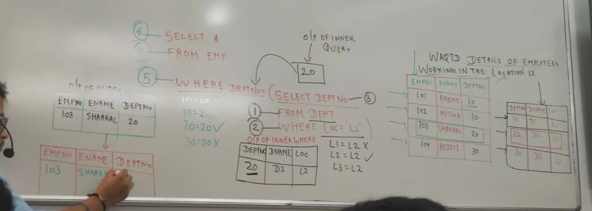

# SubQueries



<aside>
🧭

Visual: Working principle of a subquery

</aside>

```
┌───────────────┐        input         ┌───────────────┐        final        ┌───────────────┐
│  SUBQUERY     │ ───────────────▶    │  OUTER QUERY  │ ───────────────▶    │ FINAL OUTPUT  │
│ (inner query) │  produces output    │  uses input   │   returns rows      │               │
└───────────────┘                     └───────────────┘                     └───────────────┘
          ▲                                    │
          └────────────── dependent ───────────┘
```

### Subquery — clear working principle

- A subquery is a query whose result is used by another query.
- The inner query runs first and produces a value or set of values.
- The outer query consumes that output as its input and returns the final result.
- If the inner query returns no rows and the outer query expects a value, the outer query may return no rows or raise an error depending on the operator used.

> Inner first → output → used by outer → final output

```sql
SELECT *
FROM EMP
WHERE SAL > (
  SELECT SAL
  FROM EMP
  WHERE ENAME = 'CLARK'
);
```

---

### When or why do we use a subquery?

### Case 1: Unknown or indirect conditions

Use a subquery when the condition depends on a value you do not know upfront but can derive from the data.

<aside>
❓

WAQTD details of employees along with their annual salary if they were hired after ADAMS.

```sql
SELECT *, SAL * 12 AS ANNUAL_SAL
FROM EMP
WHERE HIREDATE > (
  SELECT HIREDATE
  FROM EMP
  WHERE ENAME = 'ADAMS'
);
```

</aside>

<aside>
❓

WAQTD job and salary with a 10% increment if employees earn more than SCOTT and were hired after 1980.

```sql
SELECT JOB, SAL * 1.1 AS INCR_SAL
FROM EMP
WHERE HIREDATE > DATE '1980-12-31'
  AND SAL > (
    SELECT SAL
    FROM EMP
    WHERE ENAME = 'SCOTT'
  );
```

</aside>

<aside>
❓

WAQTD names of employees whose annual salary is more than half of SMITH’s annual salary, hired after CLARK, and whose name contains ‘A’ or ‘S’.

```sql
SELECT ENAME
FROM EMP
WHERE SAL * 12 > (
        SELECT SAL * 6 FROM EMP WHERE ENAME = 'SMITH'
      )
  AND HIREDATE > (
        SELECT HIREDATE FROM EMP WHERE ENAME = 'CLARK'
      )
  AND (ENAME LIKE '%A%' OR ENAME LIKE '%S%');
```

</aside>

---

### Case 2: Data to select and condition to execute are in different tables

Use a subquery to fetch a value from one table and apply it as a condition on another.

<aside>
❓

WAQTD details of employees working in the ACCOUNTING department.

```sql
SELECT *
FROM EMP
WHERE DEPTNO = (
  SELECT DEPTNO
  FROM DEPT
  WHERE DNAME = 'ACCOUNTING'
);
```



</aside>

<aside>
❓

WAQTD details of employees working at location L2.

```sql
-- Execution order hints on the right
SELECT *          -- 6
FROM EMP           -- 4
WHERE DEPTNO = (   -- 5
  SELECT DEPTNO    -- 3
  FROM DEPT        -- 1
  WHERE LOC = 'L2' -- 2
);
```



</aside>

<aside>
❓

WAQTD department name(s) of employees who are PRESIDENT.

```sql
SELECT DNAME
FROM DEPT
WHERE DEPTNO = (
  SELECT DEPTNO
  FROM EMP
  WHERE JOB = 'PRESIDENT'
);
```

</aside>

<aside>
❓

WAQTD details of employees earning more than 2000 and working in SALES.

```sql
SELECT *
FROM EMP
WHERE SAL > 2000
  AND DEPTNO = (
    SELECT DEPTNO
    FROM DEPT
    WHERE DNAME = 'SALES'
  );
```


</aside>

<aside>
❓

WAQTD name, hiredate, and salary of employees whose annual salary is greater than ADAMS’s, hired after SMITH, and working in DALLAS.

```sql
SELECT ENAME, HIREDATE, SAL
FROM EMP
WHERE SAL * 12 > (SELECT SAL * 12 FROM EMP WHERE ENAME = 'ADAMS')
  AND HIREDATE > (SELECT HIREDATE FROM EMP WHERE ENAME = 'SMITH')
  AND DEPTNO = (SELECT DEPTNO FROM DEPT WHERE LOC = 'DALLAS');
```

</aside>

<aside>
❓

WAQTD department name(s) of CLERKs.

```sql
SELECT DNAME
FROM DEPT
WHERE DEPTNO IN (
  SELECT DEPTNO
  FROM EMP
  WHERE JOB = 'CLERK'
);
```


</aside>

---

### Quick tips

- Keep the inner query as selective as possible for better performance.
- Use IN, ANY, ALL, EXISTS for multi-row subqueries as needed.
- Prefer JOINs when you need columns from both tables in the final output; use subqueries when you only need a derived value for filtering.

[Types Of Subquery](<Types%20Of%20Subquery%2029b7ce6c5c258078a877c96975126c4f.md>)
