# Practise 1 (1)

### SQL

1. SQL stands for STRUCTURED QUERY LANGUAGE 
2. used to COMMUNICATE with RELATIONAL DATABASES.

### DATA

1. Data is a RAW FACT 
2. used to describe the ATTRIBUTE of an ENTITY 

### DATABASE

1. A database is a PLACE or a MEDIUM 
2. used to STORE DATA in a SYSTEMATIC and ORGANIZED manner

### DBMS

1. DBMS stands for DATABASE MANAGEMENT SYSTEM
2. It is a SOFTWARE 
3. used to MAINTAIN and MANAGE the database
4. It provides SECURITY FEATURES

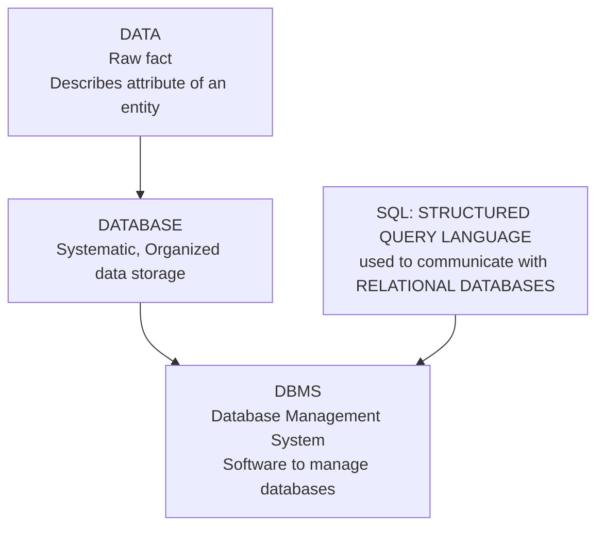

### **Authentication VS Authorization**

| **Authentication** | **Authorization** |
| --- | --- |
| Verifies user identity (WHO YOU ARE) | Grants permissions (WHAT YOU CAN DO) |
| Usually LOGIN with USERNAME/PASSWORD | Checks user’s ROLES/PERMISSIONS |
| Always BEFORE AUTHORIZATION | AFTER AUTHENTICATION |

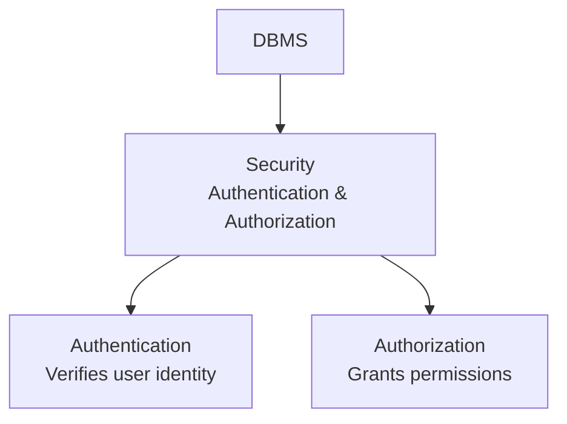

### TYPES OF DBMS

| **Types** | Data is in | **Example** |
| --- | --- | --- |
| **HIERARCHICAL** | TREE-LIKE  | IBM |
| **NETWORK** | GRAPH | Integrated Data Store |
| **RELATIONAL** | TABLES | MySQL, Oracle, SQL Server |
| **OBJECT-oriented** | OBJECTS | MongoDB Partially  |
| **NOSQL** | UNSTRUCTURED | MongoDB, Cassandra, Redis |

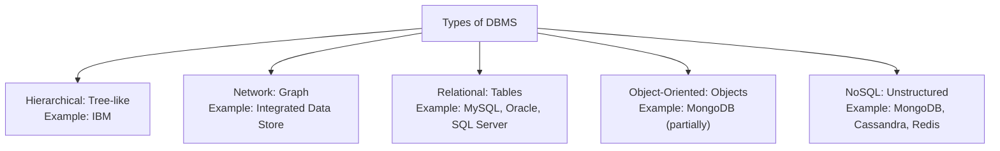

### RDBMS

1. It Stands for RELATIONAL DATABASE MANAGEMENT SYSTEM
2. It is SOFTWARE
3. used to store data in a TABULAR FORMAT
4. We use SQL to communicate with RDBMS

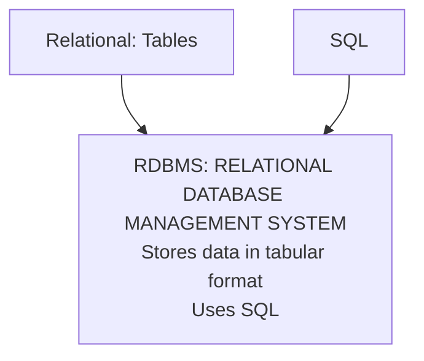

### RELEATIONAL MODEL

1. **EDGAR FRANK CODD designed the Relational Model in 1970.**
2. **Data is stored as TABLES (ROWS and COLUMNS).**
3. **A DBMS following Codd’s rules is called an RDBMS.**

### RULES OF EF CODD

1. The Data entered into a cell must be SINGLE-VALUE DATA
2. In RDBMS, we can STORE EVERYTHING, including METADATA(meta table), in the form of TABLES.
3. Data can be stored in MULTIPLE TABLES and establish a relationship between them using a KEY ATTRIBUTE.
4. Data entered must be VALIDATED using DATATYPES and CONSTRAINTS.

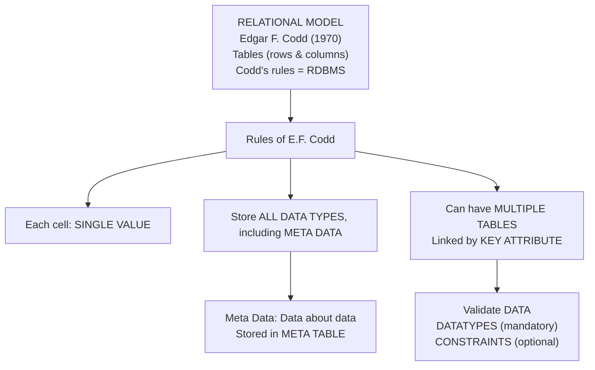

### Data Types

1. Data types describe the *type and kind of data* that can be stored in a column or a specific memory location.

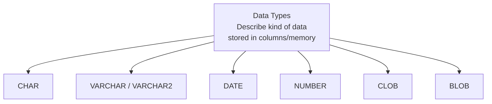

## 1. **CHAR**

- Used to store fixed-length *character* data (A–Z, a–z, 0–9, special characters).
- **Syntax:** **`CHAR(size)`**
- **Default size:** 1; **Max size:** 2000 bytes.
- Characters must be enclosed in single quotes **`'A'`**.
- **Memory:** Fixed-length (unused space padded with blanks).

**Example:** **`'HELLO'`** stored as a 5-character fixed block.

---

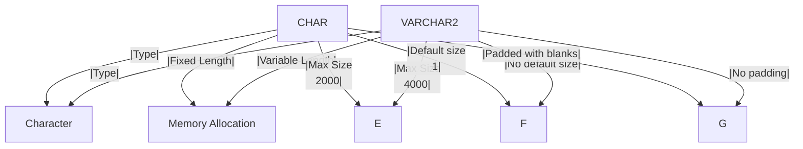

## 2. **VARCHAR / VARCHAR2**

- Used to store *variable-length* character data.
- **Syntax:** **`VARCHAR2(size)`**
- **Max size:** 4000 bytes.
- Must enclose data in single quotes **`'JAVA'`**.
- Saves memory by storing only actual length of data.
- **`VARCHAR2`** is an upgraded version of **`VARCHAR`**; internally, **`VARCHAR`** converts to **`VARCHAR2`** in Oracle.

**Example:** **`'HELLO'`** stored as 5-char actual size.

**Interview Tip:**

- **CHAR** → Fixed length, pads with spaces.
- **VARCHAR2** → Variable length, saves space.

---

## 3. **DATE**

- Used to store date/time values in standard format.
- **Syntax:** **`DATE`**
- Example formats:
    - **`'12-MAY-2002'`** (DD-MON-YYYY)
    - **`'12-MAY-02'`** (DD-MON-YY)
- Allows date operations (e.g., find day difference or sort by date).

**Why not store as VARCHAR?**

- VARCHAR cannot perform date-based calculations.

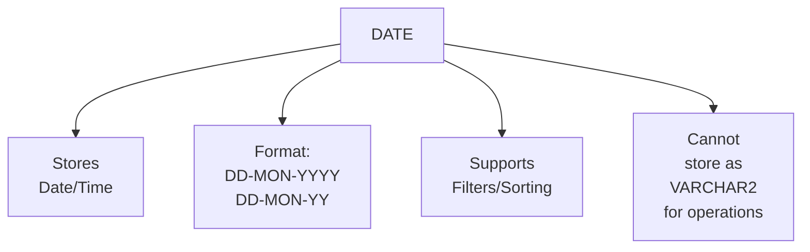

---

## 4. **NUMBER**

- Used to store numeric (integer or decimal) data.
- **Syntax:** **`NUMBER(precision, scale)`**
    - **Precision:** Total digits (max 38)
    - **Scale:** Digits after decimal (max 127)
- Combines integer and floating values.

**Example:** **`23000.232`** → precision 8, scale 3

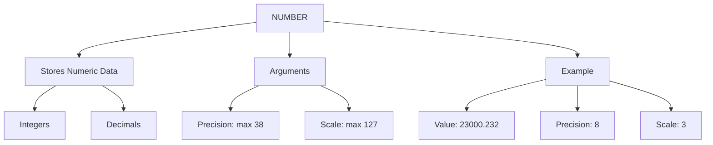

---

## 5. **LARGE OBJECTS (LOB)**

## a. **CLOB (Character Large Object)**

- Stores large text data (up to 4 GB).
- **Syntax:** **`CLOB`**
- *No size argument required.*

## b. **BLOB (Binary Large Object)**

- Stores images, audio, video in *binary* form.g
- **Syntax:** **`BLOB`**

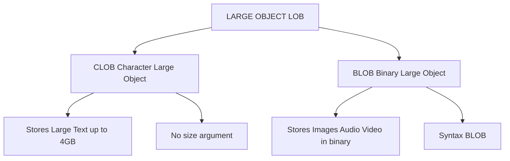

---

**Key Summary:**

| **Type** | **Stores** | **Max Size** | **Memory Type** |
| --- | --- | --- | --- |
| CHAR | Fixed-length text | 2000 | Fixed |
| VARCHAR2 | Variable-length text | 4000 | Variable |
| DATE | Date/time | N/A | N/A |
| NUMBER | Numeric values | Precision 38, Scale 127 | Numeric |
| CLOB | Large text | 4 GB | Character Large |
| BLOB | Binary (media) | 4 GB | Binary Large |

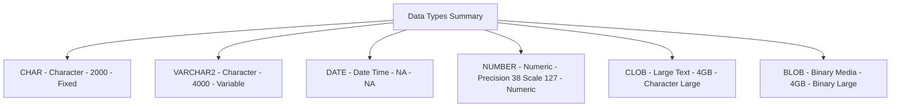