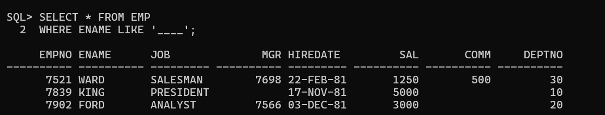

# Length

Sr_no: 1

## Length :

- It is used to return length of the characters or number present inside the given column.
- It also used to return length of char or varchar data type (count of charactors)
- Example:

```sql
SELECT LENGTH(ENAME), ENAME 
FROM EMP;
```

<aside>
❓

WAQTD DETAILS OF EMPLOYEES IF THEY HAVE EXACTLY 4 CHARACTORS IN THEIR NAME

```sql
SELECT * FROM EMP
WHERE ENAME LIKE '____';
```



OR

```sql
SELECT * FROM EMP
WHERE LENGTH(ENAME) = 4;
```


</aside>

[UPPER](UPPER%202a77ce6c5c25808aa317d38e839be557.md)